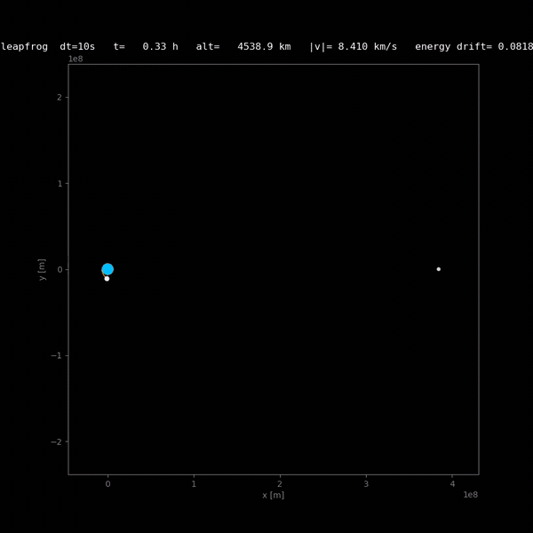

# apollo

Stochastic optimization of Earth–Moon trajectories: a playable 2D simulator
(real masses, Earth and Moon fixed, symplectic leapfrog) plus Bayesian
trajectory search with [Korali](https://github.com/cselab/korali).



*The TMCMC-optimal transfer (4× speed): ~135 h to a 100 km lunar periapsis,
arriving as slowly as physics allows ([video](media/apollo_tmcmc_winner_4x.mp4)).*

## Files

| | |
|---|---|
| `orbit_sim.py` | playable simulator — headless, live window, or video |
| `apollo_model.py` | fast `simulate(angle, altitude_km, extra_speed)` for samplers |
| `run_tmcmc_apollo.py` | Korali TMCMC over the three TLI burn parameters |
| `plot_corner.py` | corner plot with the historical Apollo 8 overlay |

## Run

```bash
python3 orbit_sim.py            # simulator; settings at the top of the file
python3 run_tmcmc_apollo.py     # TMCMC, ~20 min on 8 cores
                                # (Korali env paths: see its docstring)
python -m korali.plot --dir results/_korali_result_apollo
```

## Score

`logL = − Σ Wᵢ (errorᵢ/σᵢ)²`, one term per mission objective. Weight knobs in
`run_tmcmc_apollo.py`: `W_PERIAPSIS` (hit 100 km), `W_CAPTURE` (small capture
burn), `W_TLI` (injection fuel), `W_TIME` (fast transfer); `W = 0` disables.

## Result

With the Moon fixed, energy conservation makes a no-burn capture impossible:
every posterior sample arrives ~630 m/s above lunar circular speed, paying it
with the slowest transfer that still gets there
([corner plot](media/apollo_corner_korali.png), samples in `results/`).
